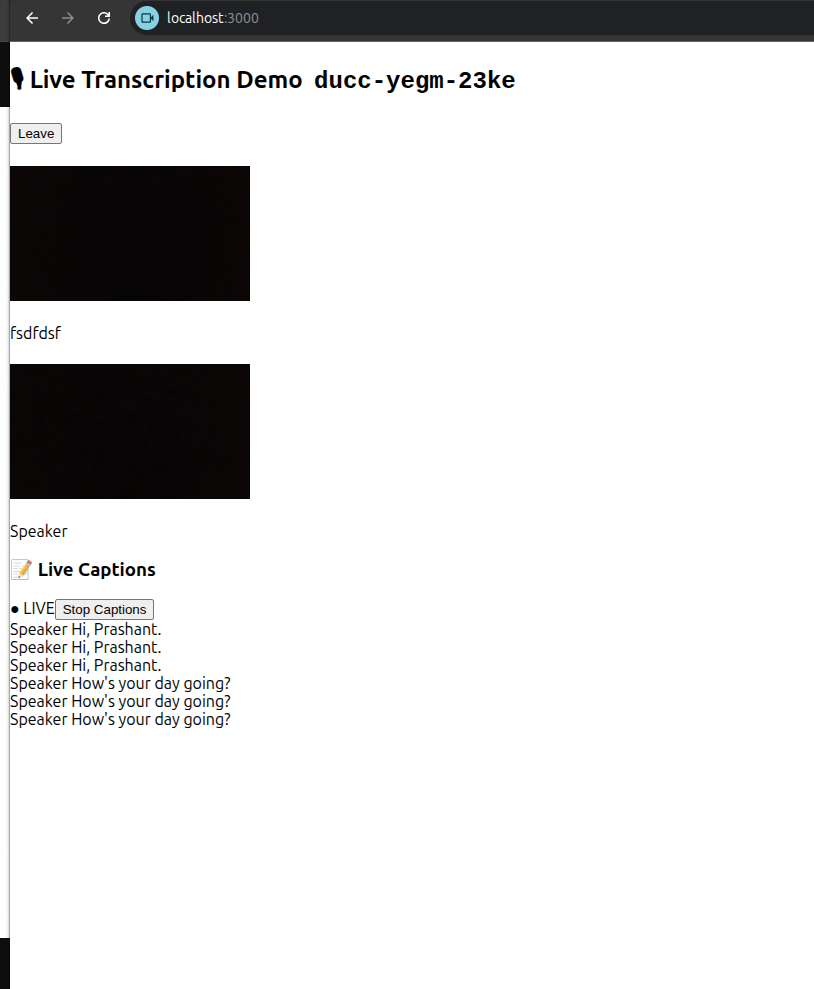

# Example 1 - Real-time Transcription with VideoSDK

Demonstrates VideoSDK's `useTranscription` hook. Speak during a video call and your words will appear as live captions, tagged with each speaker's name. No third-party speech API needed.

## SDK Feature Used

```js
import { useTranscription, Constants } from "@videosdk.live/react-sdk";

const { startTranscription, stopTranscription } = useTranscription({
  onTranscriptionStateChanged: ({ status }) => { ... },

  onTranscriptionText: ({ participantName, text }) => { ... },
});

startTranscription({ webhookUrl: null, summary: { enabled: false } });

stopTranscription();
```

Docs: https://docs.videosdk.live/react/guide/video-and-audio-calling-api-sdk/transcription-and-summary/realtime-transcribe-meeting

## Setup

```bash
git clone https://github.com/shantkhatri/videosdk-example-transcription
cd videosdk-example-transcription
npm install
```

Paste your token, which is generated from VideoSDK-dashboard, in `src/API.js`:
```js
export const authToken = "<Generated-from-dashbaord>";
```

```bash
npm start
```

## How to Test
1. Open two browser tabs, join the same meeting ID
2. Click **Start Captions**
3. Speak in either tab, captions appear for all participants live



We have same caption multiple times, the reason is, on my system the voice was getting echo due to joining same meeting on the same system, that's why here we have same caption added multiple times.

## File Structure
```
   root
   ├── node_modules
   ├── public
   ├── src
   │    ├── API.js
   │    ├── App.js
   │    ├── index.js
   .    .
```